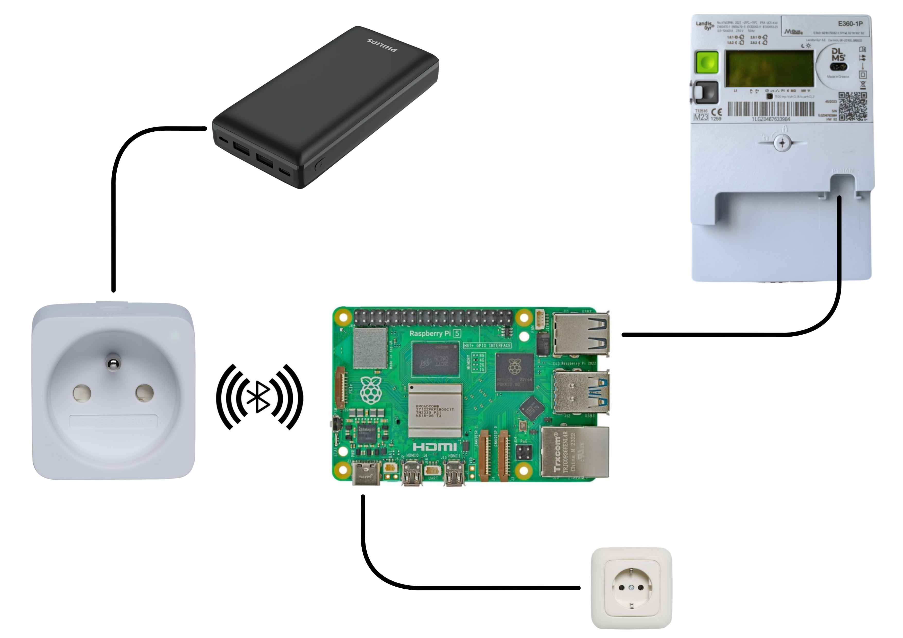

# Green Plug: Solar Energy Buffer 

A proof of concept for a "green plug" automation built in Home Assistant. This project dynamically switches a smart plug on when solar energy production exceeds the household's current electricity consumption. 

By consuming power locally during peak production hours, it maximizes self-consumption and reduces grid dependency. When combined with power banks or batteries, it effectively creates an efficient home energy buffer.

A photo of the concept and the technical lay-out are given below.
<p align="center">


  
## How It Works

The automation monitors real-time data from a digital electricity meter (via a P1 connection). A digital meter handles grid data through two mutually exclusive streams:
1. **Grid Consumption (OBIS 1.7.0):** Active power currently being pulled *from* the grid (greater than 0W when demand exceeds solar production).
2. **Grid Production/Injection (OBIS 2.7.0):** Active power currently being fed *into* the grid (greater than 0W when solar production exceeds demand).

Because net-metering ensures that only one of these sensors is active at a time, the automation evaluates:
* **Turn ON:** If `Production > Consumption` (meaning there is an active solar surplus) AND the plug hasn't been turned off in the last 5 minutes.
* **Turn OFF:** If `Production < Consumption` (meaning the household is actively pulling power from the grid again).

## Prerequisites

To replicate this setup, you will need:
* **Home Assistant** used as the digital platform.
* **Raspberry Pi or similar** used as the device to run the software.
* **A Digital Electricity Meter** with an active P1 port (e.g., Fluvius meter in Flanders) linked to Home Assistant via the DSMR integration.
* **A Smart Plug** integrated into Home Assistant (e.g., a Philips Hue BLE Smart Plug configured as a `light` or `switch` entity).
* **RJ11<->USB Cable** to connect the Electricity meter with the Raspberry Pi.

## Installation & Configuration

### 1. Visually via the UI
You can easily build this automation using the Home Assistant visual editor blocks:

1. Create a new automation and add two **State** triggers:
   * `sensor.electricity_meter_energieproductie`
   * `sensor.electricity_meter_energieverbruik`
2. Leave the `From` and `To` fields empty so it triggers on any numerical update.
3. Add a **Choose** action with two options:
   * **Option 1 (Turn On Conditions):** Add a *Template condition* for `production > consumption`, a *State condition* checking if the plug is `off`, and a *Template condition* for the 5-minute cooldown (`> 300`).
   * **Option 2 (Turn Off Conditions):** Add a *Template condition* for `production < consumption` and a *State condition* checking if the plug is `on`.

### 2. Via YAML Editor
Alternatively, create a blank automation, switch to the YAML editor, and paste the following code. Make sure to replace the entity names with your own:

```yaml
alias: "Energy: Green Plug Dynamic Toggling"
description: "Toggles a smart plug based on real-time solar surplus with a 5-minute restart protection."
trigger:
  - platform: state
    entity_id: sensor.electricity_meter_energieproductie
  - platform: state
    entity_id: sensor.electricity_meter_energieverbruik
condition: []
action:
  - choose:
      # LOGIC FOR TURNING ON (Production > Consumption)
      - conditions:
          - condition: template
            value_template: "{{ states('sensor.electricity_meter_energieproductie') | float(0) > states('sensor.electricity_meter_energieverbruik') | float(0) }}"
          - condition: state
            entity_id: light.hue_smart_plug
            state: "off"
          # Cooldown: Ensures the plug stays off for at least 5 minutes (300 seconds) before turning back on
          - condition: template
            value_template: "{{ (as_timestamp(now()) - as_timestamp(states.light.hue_smart_plug.last_changed)) > 300 }}"
        sequence:
          - service: light.turn_on
            target:
              entity_id: light.hue_smart_plug

      # LOGIC FOR TURNING OFF (Production < Consumption)
      - conditions:
          - condition: template
            value_template: "{{ states('sensor.electricity_meter_energieproductie') | float(0) < states('sensor.electricity_meter_energieverbruik') | float(0) }}"
          - condition: state
            entity_id: light.hue_smart_plug
            state: "on"
        sequence:
          - service: light.turn_off
            target:
              entity_id: light.hue_smart_plug
mode: single
